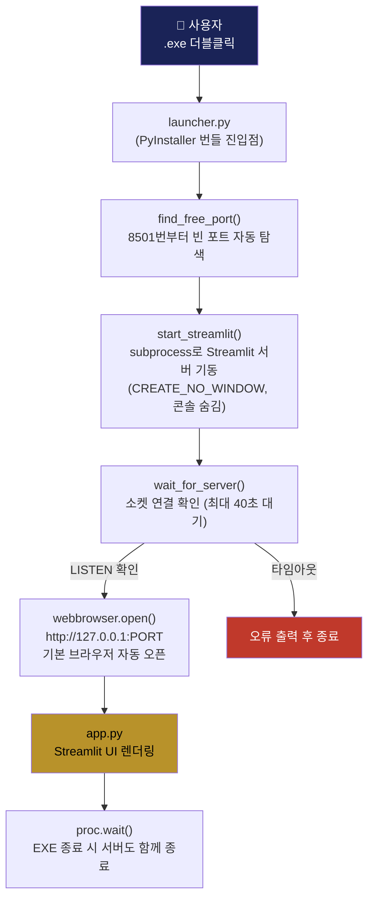
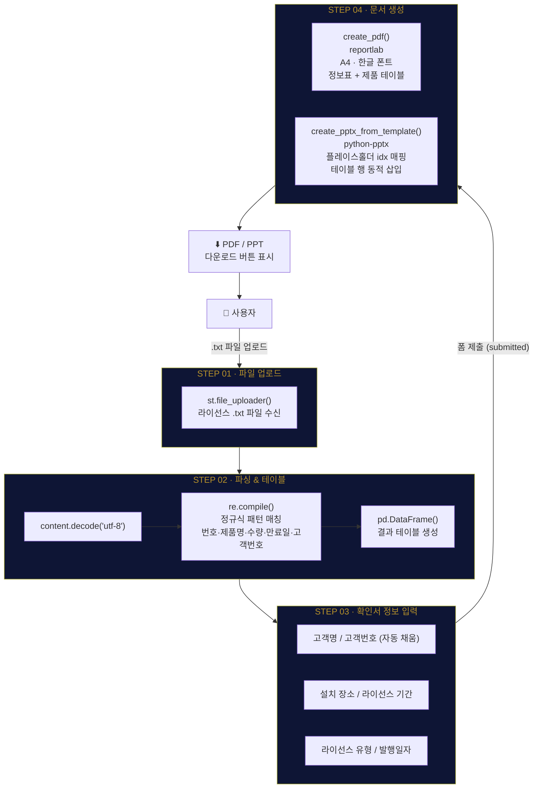
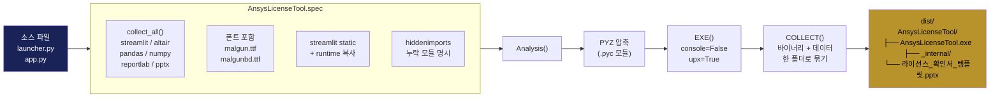

# Ansys 라이선스 확인서 생성기

> **POSCO EnC 태성에스엔이 내부 전용 도구**  
> Streamlit 기반 웹앱 → Windows 단독 실행 EXE 패키징

---

## 📁 폴더 구조

```
ansys-license-tool/
├── app.py                          ← Streamlit 앱 (메인 UI / 핵심 로직)
├── launcher.py                     ← EXE 진입점 (서버 + 브라우저 자동 실행)
├── AnsysLicenseTool.spec           ← PyInstaller 빌드 설정
├── build.bat                       ← 원클릭 빌드 스크립트
├── run_dev.bat                     ← 개발 테스트용 실행 스크립트
├── 라이선스_확인서_템플릿.pptx       ← (별도 제공) PPT 슬라이드 템플릿
└── README.md
```

---

## 🏗️ 아키텍처 흐름도

### 전체 실행 흐름 (EXE → 브라우저)



---

### 앱 동작 흐름 (app.py 내부)



---

### EXE 빌드 파이프라인 (PyInstaller)



---

## ⚡ 빠른 시작

### 개발 환경 테스트 (EXE 불필요)

```bat
run_dev.bat
```

브라우저에서 `http://localhost:8501` 자동 열림

### EXE 빌드

```bat
build.bat
```

완료 후 `dist\AnsysLicenseTool\AnsysLicenseTool.exe` 생성

---

## 📦 의존성

```bash
pip install streamlit pandas reportlab python-pptx pyinstaller
```

| 패키지 | 용도 |
|---|---|
| `streamlit` | 웹 UI 프레임워크 |
| `pandas` | 라이선스 데이터 테이블 처리 |
| `reportlab` | PDF 생성 (한글 폰트 지원) |
| `python-pptx` | PPT 템플릿 기반 슬라이드 생성 |
| `pyinstaller` | Python → Windows EXE 패키징 |

---

## 📄 PPT 템플릿 배치

PPT 다운로드 기능을 사용하려면 **`라이선스_확인서_템플릿.pptx`** 파일을 아래 위치에 복사하세요:

| 환경 | 경로 |
|---|---|
| 개발 | `app.py` 와 같은 폴더 |
| EXE 빌드 후 배포 | `dist\AnsysLicenseTool\` |

> 템플릿이 없으면 **PDF 다운로드는 정상 작동**, PPT는 오류 메시지 표시.

---

## 🚚 EXE 배포

`dist\AnsysLicenseTool\` 폴더 **전체**를 사용자에게 전달합니다.

```
dist\AnsysLicenseTool\
├── AnsysLicenseTool.exe          ← 이것만 실행하면 됨
├── _internal\                    ← 런타임 라이브러리 (건드리지 말 것)
└── 라이선스_확인서_템플릿.pptx    ← 반드시 함께 배포
```

> ⚠️ **EXE 단독 복사 시 동작하지 않습니다. 폴더 전체 배포 필수.**

---

## 📝 라이선스 파일 패턴 예시

앱이 인식하는 `.txt` 파일 패턴 (정규식 추출):

```
# 1. Ansys Mechanical Enterprise: 5 task(s) expiring 31-Dec-2026
#    Customer # 1213401
```

| 필드 | 예시 값 |
|---|---|
| No | `1` |
| Software (제품명) | `Ansys Mechanical Enterprise` |
| QTY (수량) | `5` |
| 만료일 (ExpireDate) | `31-Dec-2026` |
| 고객번호 (CustomerNo) | `1213401` |

---

## 🔧 트러블슈팅

| 증상 | 원인 | 해결 |
|---|---|---|
| PPT 오류 메시지 | 템플릿 파일 없음 | `.pptx` 파일을 같은 폴더에 배치 |
| 한글 깨짐 (PDF) | 폰트 경로 없음 | `C:\Windows\Fonts\malgun.ttf` 확인 |
| 라이선스 항목 0개 | txt 파일 형식 불일치 | 위 패턴 예시와 비교 |
| EXE 실행 후 브라우저 미열림 | 방화벽 차단 | `127.0.0.1:8501` 로컬 포트 허용 |
| EXE 실행 후 서버 시작 실패 | 40초 타임아웃 초과 | 백신 예외 처리 또는 재실행 |

---

**태성에스엔이 내부 사용 전용**
